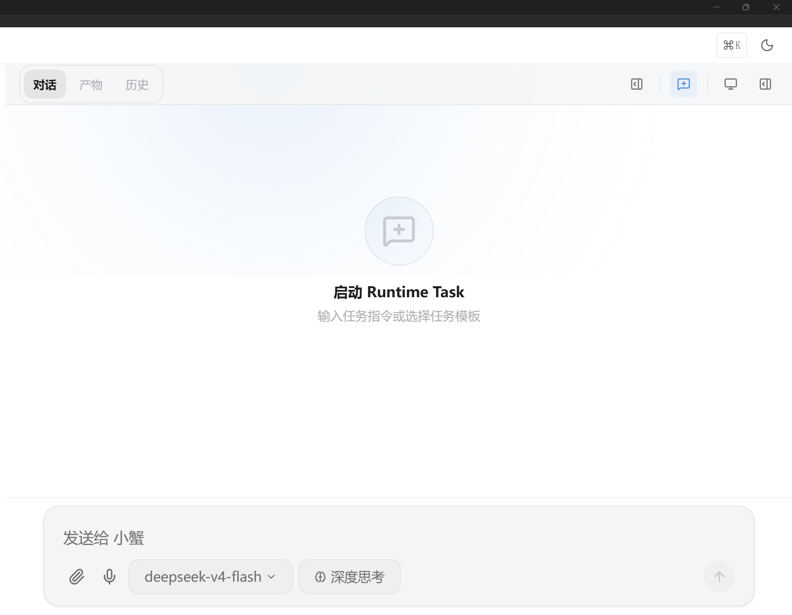
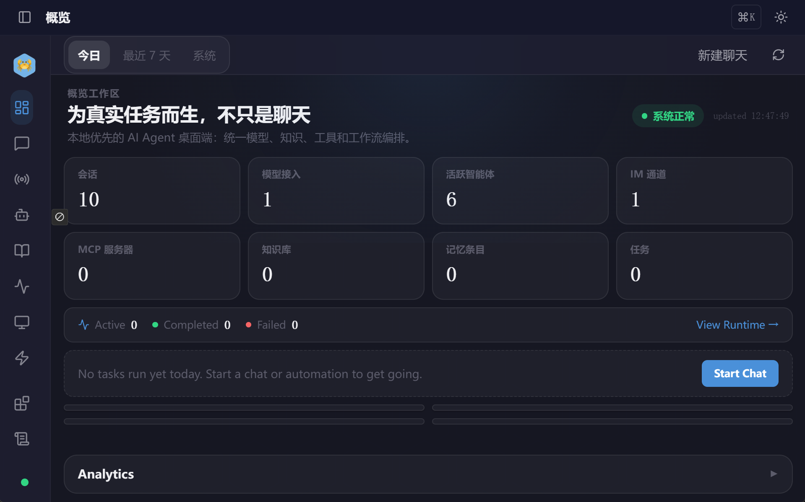
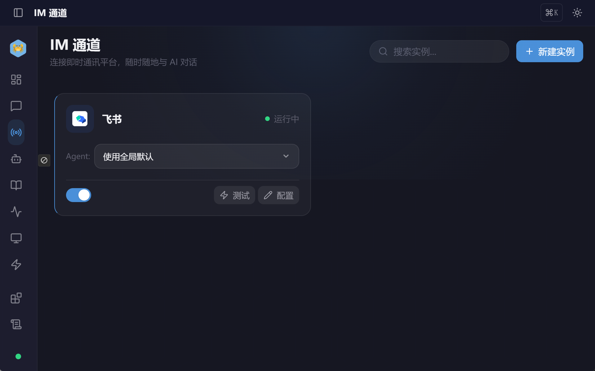
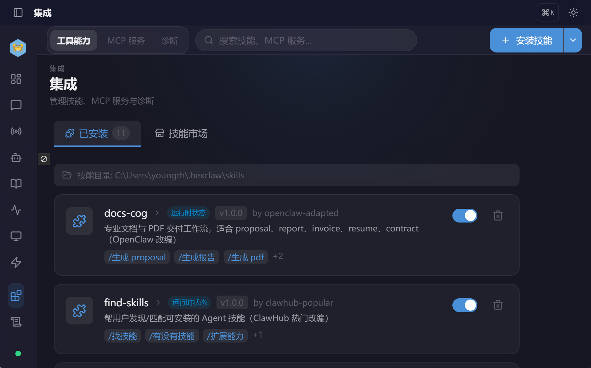
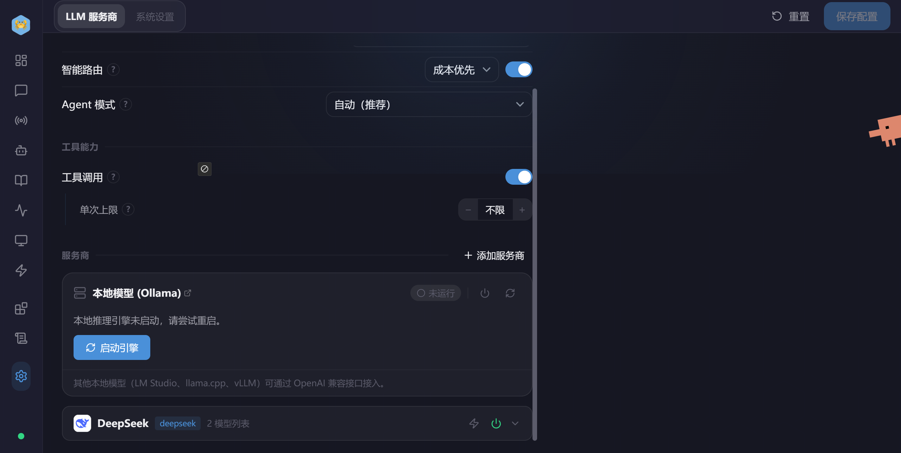

<div align="center">

[English](README.en.md) | **中文**

# Mr.Krabs Desktop

**Local-first AI-native Runtime Workspace**

[](https://github.com/yunzaibo/-Mr.Krabs-desktop-/actions)
[](https://github.com/yunzaibo/-Mr.Krabs-desktop-/releases)
[](https://github.com/yunzaibo/-Mr.Krabs-desktop-/blob/main/LICENSE)
[](https://github.com/yunzaibo/-Mr.Krabs-desktop-/releases)
[](https://github.com/yunzaibo/-Mr.Krabs-desktop-)

[](https://v2.tauri.app)
[](https://vuejs.org)
[](https://www.typesqlang.org)
[](https://www.rust-lang.org)
[](https://go.dev)

</div>

---

一个用自然语言驱动本地 AI Agent 持续运行的桌面工作空间。数据完全私有，零云端依赖，跨平台原生体验。

## 我们在解决什么问题

当前 AI Agent 生态存在一个根本性缺口：**没有真正的 Runtime OS**。

- Chat UI 只是问答窗口，无法承载真实任务的运行状态
- Agent 缺乏运行时可观测性 —— 执行到哪了、推理了什么、工具调用结果如何，用户一无所知
- Context Window 天然有限，但任务和数据无限增长
- 长期记忆容易失真、遗忘、上下文挤出窗口
- 工作流/BPMN 系统过度低代码化，复杂且脆弱
- 云端 Agent 存在数据安全和隐私问题

  **Mr.Krabs Desktop 不是聊天机器人，不是 Workflow Builder，而是 Local-first AI Runtime Workspace。**

  用户用自然语言启动任务，系统在本地 Runtime 中持续运行，上下文、资产、执行状态跨会话持久化。数据完全由用户控制。

### **项目预览图：**











## 核心技术亮点

| 能力 | 技术方案 | 为什么这么设计 |
| --- | --- | --- |
| **Sidecar 架构** | Tauri (Rust) 壳 + Go 引擎进程，IPC 代理通信 | 隔离 WebView CORS 限制；Go 引擎可独立迭代和热重启；借鉴 Docker Desktop 管理 Engine 的成熟模式 |
| **多模型路由** | 统一 Provider 适配层，支持 OpenAI / Anthropic / Gemini / Ollama 等 6+ 后端 | 一套对话界面覆盖商业 API + 本地模型，用户无需关心底层差异 |
| **Agent 编排** | Handoff + Orchestrate + Spawn 三种协作模式，三维预算兜底 (token/时间/金额) | 复杂任务拆解为多 Agent 协作，预算机制防止失控消耗 |
| **Skill 系统** | skill.json + SKILL.md + references/ 标准化包结构，NL 触发 + @mention 双入口 | 可扩展的技能生态，社区贡献与自定义开发统一范式 |
| **安全网关** | Prompt 注入检测 / 工具输出清洗 / PII 过滤 / RBAC / SSRF 防护，五层防御 | Agent 可执行代码和调用工具，安全边界是生产可用的前提 |
| **MCP 协议** | Model Context Protocol 工具集成 (stdio/SSE/Streamable HTTP)，OAuth 2.0+PKCE | 对接 MCP 生态标准，同时保证认证安全 |
| **知识库 RAG** | 文档解析 → 向量检索 → Auto-RAG 自动注入上下文 | 让 Agent 基于用户私有知识回答，而非仅依赖模型训练数据 |
| **记忆系统** | 长期 + 短期记忆，语义搜索，跨会话持久化 | Agent 记住用户偏好和历史上下文，越用越懂你 |
| **多模态生成** | 统一 ChatInput 入口，按模型 capability 自动路由 gpt-image-2（图像）/ 视频生成 2.0，结果本地落盘 + URL 引用 | 一套对话界面覆盖文本、图像、视频生成；生成资产持久化到本地 Runtime，不依赖云端存储 |
| **Runtime 实时状态** | TaskStatusIndicator 脉冲指示器 + 已用时间计数器，Vue reactivity 驱动，CSS-only 动画 | 运行中任务一目了然，20+ 并发任务无帧率下降 |
| **Recovery 操作界面** | RecoveryActionPanel 重试/重置操作，确认对话框保护，isExecuting 状态锁 | 失败任务可一键恢复，操作闭环不离开 Workspace |

## Engineering Challenges

### Context Explosion

LLM 上下文窗口有限，但用户任务和对话历史无限增长。简单截断或摘要压缩会导致记忆丢失、任务漂移、幻觉、长运行 Agent 不稳定。

Mr.Krabs 的方案：

| 策略 | 实现 |
| --- | --- |
| **分层记忆** | 工作记忆（当前任务状态）+ 短期记忆（对话历史）+ 长期记忆（持久化存储），按生命周期分层管理 |
| **RAG 检索** | 不把所有信息塞进窗口，按需从本地向量库检索相关内容注入上下文 |
| **摘要压缩** | 对历史对话做摘要，保留关键信息，丢弃细节 |
| **本地优先持久化** | 状态存本地，不依赖云端，跨会话保留 |

### 成本控制

AI API 按 token 计费，多 Agent 并行时成本容易失控。

Mr.Krabs 的方案：

- **三维预算系统**（token / 时间 / 金额）：在 Task 粒度设置上限，每次 LLM 调用前检查，超限自动终止并回滚
- **Checkpoint 机制**：长任务断点恢复，避免重复消耗
- **本地推理**：支持 Ollama 等本地模型，零 API 成本

### 可靠性与容错

LLM 输出不稳定 —— 同一问题可能返回不同答案，格式甚至不符合预期。在不确定性之上构建确定性，是 AI 工程化的核心挑战。

Mr.Krabs 的方案：

- **安全网关**：五层防御（Prompt 注入检测 / 工具输出清洗 / PII 过滤 / RBAC / SSRF 防护）
- **Agent 协作预算兜底**：防止 Agent 失控消耗
- **Skill 沙箱**：`skill_sandbox.rs` 的 restricted 模式限制目录访问、清理环境变量、强制超时
- **确定性工程**：优先用规则和校验，不依赖模型"猜对"

### 运行时可观测性

大多数 AI Agent 像黑盒 —— 用户无法观察执行状态、中间推理、工具调用、资产生命周期。

Mr.Krabs 重新定义交互模型：

```
传统:  Chat → Answer
Mr.Krabs: Chat → Task → Runtime → Workspace
```

每个 Task 在 Runtime 中持续运行，执行状态、中间结果、工具调用全程可观察。

### Skill 工程

大多数 AI 工作流系统最终退化为 BPMN-like 节点编排平台 —— 视觉复杂、维护困难、不适合自然语言交互。

Mr.Krabs 相信 Skill 应该：

- **轻量**：一个文件夹 + `SKILL.md` + 可选运行时资产
- **Markdown-first**：用自然语言定义行为，不是拖拽节点
- **可移植**：标准化 `skill.json` 包结构，社区可共享
- **运行时导向**：Skill 在 Runtime 中执行，不是静态配置

## Design Philosophy

- **Chat is only the entry point** — 运行时才是真正的工作空间
- **Runtime is the real product** — 不是问答窗口，是持续运行的任务引擎
- **Explicit mutation over implicit magic** — 状态变更必须明确、可观察、可审计
- **Local-first over cloud dependency** — 数据和状态完全由用户控制
- **Skills over workflows** — 轻量、可移植、Markdown-first，而非节点编排
- **Runtime visibility over black-box automation** — 执行状态全程可观察
- **Deterministic engineering over prompt gambling** — 用规则和校验，不依赖模型"猜对"
- **Simplicity over complexity** — 能用简单方案解决的，绝不引入复杂抽象

## 架构

```
Mr.Krabs.app
┌───────────────────────────────────────────────────────────────────┐
│  Tauri Shell (Rust)                                               │
│  窗口管理 · 系统托盘 · 原生菜单 · 全局快捷键 · 单实例 · 自动更新  │
│  API 代理 (CORS bypass) · Sidecar 进程管理                        │
├───────────────────────────────────────────────────────────────────┤
│  Vue 3 前端 (WebView)                                             │
│  Pinia Store · Vue Router · Tauri IPC                             │
├───────────────────────────────────────────────────────────────────┤
│  Tauri Commands (Rust → Go)                                       │
│  API 代理 · 流式聊天 · Sidecar 生命周期 · 平台信息                │
├───────────────────────────────────────────────────────────────────┤
│  HTTP / WebSocket  ←→  localhost:16060                            │
├───────────────────────────────────────────────────────────────────┤
│  hexclaw serve (Go Sidecar)                                       │
│  Agent 引擎 · LLM 路由 · RAG · MCP · 安全网关 · Skill · Cron     │
└───────────────────────────────────────────────────────────────────┘
```

### 设计决策

**为什么选 Sidecar 而不是 FFI？**
Go 引擎涉及大量网络 I/O（LLM API 调用、MCP 通信），FFI 会阻塞 Rust 线程。Sidecar 进程天然隔离，可独立重启，崩溃不影响 Tauri 壳。Docker Desktop 验证了这个模式在桌面场景的可靠性。

**为什么 Rust + Go 而不是全 Rust？**
Tauri 生态天然绑定 Rust，用 Rust 处理窗口/托盘/IPC 最合适。Go 在并发网络编程和快速迭代上有优势，Agent 引擎用 Go 开发效率更高。两层通过 HTTP 解耦，各自独立部署和测试。

**为什么前端不用 Electron？**
Tauri 二进制约 5MB（Electron 约 150MB），内存占用低 3-5 倍。Rust 壳的启动速度和原生感是 Electron 无法比拟的。代价是 Rust 学习曲线，但 Tauri 插件生态已经覆盖了大部分桌面能力。

## 技术栈

| 层 | 技术 | 选型理由 |
| --- | --- | --- |
| 桌面框架 | Tauri v2 | 轻量、原生、安全，Rust 生态 |
| 前端 | Vue 3 + TypeScript + Pinia | 组合式 API 适合复杂状态管理 |
| UI | Naive UI + Tailwind CSS | 组件丰富 + 原子化样式 |
| Markdown | markdown-it + Shiki | 可扩展渲染 + 多语言代码高亮 |
| 后端 | Go Sidecar | 并发网络编程优势，快速迭代 |
| Rust 层 | Tauri Shell + 插件 | 窗口/托盘/IPC/自动更新 |
| 测试 | Vitest + @vue/test-utils | Vite 原生集成，速度快 |
| Lint | ESLint + oxlint + Prettier | 规则互补，oxlint 负责速度 |

## 技术挑战与解决方案

### 1. WebView CORS 绕过

**问题**：Tauri WebView 有跨域限制，前端无法直接调用 Go Sidecar 的 REST API。

**方案**：Rust 层实现 `proxy_api_request` 命令，所有 HTTP 请求经 Tauri IPC 代理转发。前端完全感知不到 CORS，代码零侵入。

### 2. 多 Agent 协作与预算控制

**问题**：多个 Agent 并行执行时，如何防止 token 消耗失控？

**方案**：三维预算系统（token / 时间 / 金额），在 Task 粒度设置上限。Agent 每次调用 LLM 前检查预算，超限自动终止并回滚。Checkpoint 机制支持长任务断点恢复。

### 3. Skill 安全沙箱

**问题**：用户导入的 Skill 可能包含恶意脚本，如何在功能性和安全性之间平衡？

**方案**：`skill_sandbox.rs` 实现 restricted/full 两种模式。restricted 模式清理环境变量、限制目录访问、强制超时；full 模式继承父进程环境（用于 trusted skill）。输出大小上限 1 MiB，防止内存爆炸。

### 4. 跨平台一致性

**问题**：macOS / Windows / Linux 的文件系统、权限模型、打包格式差异巨大。

**方案**：Tauri 抽象层处理平台差异；Go Sidecar 用交叉编译输出四个平台二进制；Homebrew/NSIS/AppImage 覆盖各平台分发；CI 自动化构建和发布。

## Claude Code 开发实战 SOP

这个仓库同时是"**用 AI 辅助工具做出一个能跑的产品**"的工作流实录。

| 主线 | 核心做法 |
| --- | --- |
| **设计驱动** | Plan 模式 → 多方案对比 → ADR 决策，不做"一句话 + 秒出代码" |
| **测试闭环** | 不接受 "should pass" / "probably OK"——测试跑过、grep 扫过残留才算完成 |
| **多 Agent 协作** | Claude 写代码 / Codex 审代码 / 人类决策，交叉审查消除单模型盲区 |

## Runtime Architecture

```
Cloud Control Plane
├── License
├── Skill Registry
├── Analytics
└── API Gateway

Local Runtime Plane
├── Chat Workspace          ← 自然语言入口
├── Task Runtime            ← 任务执行引擎
├── Skill Runtime           ← Skill 沙箱执行
├── Context Runtime         ← 上下文管理与 RAG
├── Memory Runtime          ← 分层记忆系统
├── Asset Runtime           ← 资产生成与持久化
├── Browser Runtime         ← 浏览器自动化
└── Security Gateway        ← 五层安全防御
```

## Current Research Areas

本项目持续探索的工程方向：

- 上下文工程（Context Engineering）
- 长期记忆系统（Long-term Memory Systems）
- 运行时可观测性（Runtime Observability）
- 本地优先 AI 架构（Local-first AI Architecture）
- 能力运行时（Capability Runtime）
- Skill 打包协议（Skill Packaging Protocol）
- 运行时持久化与恢复（Runtime Persistence & Recovery）
- 浏览器自动化运行时（Browser Automation Runtime）
- AI 原生工作空间交互（AI-native Workspace Interaction）

## This Project Is NOT

- 不是聊天机器人包装器（chatbot wrapper）
- 不是低代码工作流构建器（low-code workflow builder）
- 不是 BPMN 编排系统（BPMN orchestration system）
- 不是 AutoGPT 克隆
- 不是 Prompt 集合工具

本项目探索的是：

> **AI-native Runtime Systems** — 在 LLM 的不确定性之上，构建可靠的确定性系统。

## 安装

### 一键安装 (macOS)

```bash
curl -fsSL https://raw.githubusercontent.com/yunzaibo/-Mr.Krabs-desktop-/main/install.sh | bash
```

### Homebrew (macOS)

```bash
brew tap hexagon-codes/tap
brew install --cask hexclaw
```

### GitHub Releases

前往 [Releases](https://github.com/yunzaibo/-Mr.Krabs-desktop-/releases) 下载对应平台安装包。

| 平台 | 格式 |
| --- | --- |
| macOS (Apple Silicon / Intel) | `.dmg` |
| Windows | `.msi` / `.exe` (NSIS) |
| Linux | `.deb` / `.AppImage` |

> macOS 用户如果遇到 Gatekeeper 拦截：`xattr -cr /Applications/HexClaw.app`

## 开发

### 前置要求

| 工具 | 版本 |
| --- | --- |
| Node.js | >= 20.19 或 >= 22.12 |
| pnpm | >= 9 |
| Rust | stable (2021 edition) |
| Go | >= 1.25 |

### 快速开始

```bash
git clone https://github.com/yunzaibo/-Mr.Krabs-desktop-.git
cd -Mr.Krabs-desktop-
make install
make sidecar    # 首次编译 Go sidecar
make dev        # 启动开发模式
```

### 常用命令

| 命令 | 说明 |
| --- | --- |
| `make dev` | 开发模式 (Vite HMR + Tauri) |
| `make build` | 生产构建 |
| `make sidecar` | 编译 Go sidecar |
| `make lint` | 代码检查 |
| `make test` | 运行测试 |
| `make type-check` | TypeScript 类型检查 |

## 贡献指南

1. Fork → 创建分支 `feat/xxx` → 提交 → PR
2. 代码规范：`make format` + `make lint`
3. Commit 遵循 [Conventional Commits](https://www.conventionalcommits.org/)

## License

[Apache License 2.0](LICENSE)
